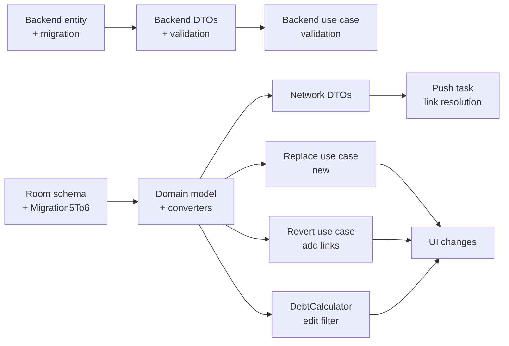

# Expense Correction / Reversal Implementation

## Approach

Add 2 nullable link fields to the mobile expense entity (`revertsExpenseClientCreateId`, `replacesExpenseClientCreateId`) and 2 corresponding server-ID fields to the backend (`revertsExpenseId`, `replacesExpenseId`). Mobile always references by `clientCreateId` (always present on every expense); the network layer maps between `clientCreateId` and `serverId` at push/pull time. Void and edit both create new expense rows referencing the original. The append-only sync model is preserved: push and pull remain create/insert-only. Debt calculation adds a pre-filter to exclude replaced originals.

## Data Flow

```mermaid
flowchart TD
  subgraph void_flow [Void Flow]
    VoidAction["User taps Revert"] --> CreateReversal["Create new expense\nrevertsExpenseClientCreateId = original.clientCreateId\nnegated amounts, flipped type"]
    CreateReversal --> LocalInsert["Insert into Room\nserverId = null"]
    LocalInsert --> PushAsCreate["Push: resolve clientCreateId to serverId\nPOST .../expense with revertsExpenseId"]
  end

  subgraph edit_flow [Edit Flow]
    EditAction["User taps Edit"] --> PreFill["Pre-fill AddExpensePane\nfrom original values"]
    PreFill --> SaveReplacement["Create new expense\nreplacesExpenseClientCreateId = original.clientCreateId\ncorrected values"]
    SaveReplacement --> LocalInsert2["Insert into Room\nserverId = null"]
    LocalInsert2 --> PushAsCreate2["Push: resolve clientCreateId to serverId\nPOST .../expense with replacesExpenseId"]
  end

  subgraph debt_calc [Debt Calculation]
    AllExpenses["All expenses"] --> Filter["Exclude expenses where\nclientCreateId in replacedClientCreateIds"]
    Filter --> ExistingCalc["Existing DebtCalculator\n(unchanged arithmetic)"]
  end
```




---

## Layer 1: Backend

### 1a. Domain entity — [backend/src/domain/entities/expense.entity.ts](backend/src/domain/entities/expense.entity.ts)

Add two optional fields to `IExpense`:

```typescript
revertsExpenseId?: string;   // server ID of the expense being voided
replacesExpenseId?: string;  // server ID of the expense being replaced (edit)
```

### 1b. Postgres entity — [backend/src/frameworks/relational-data-service/postgres/entities/expense.entity.ts](backend/src/frameworks/relational-data-service/postgres/entities/expense.entity.ts)

Add two nullable varchar columns:

```typescript
@Column({type: 'varchar', nullable: true})
revertsExpenseId!: IExpense['revertsExpenseId'];

@Column({type: 'varchar', nullable: true})
replacesExpenseId!: IExpense['replacesExpenseId'];
```

### 1c. TypeORM migration — new file in `backend/migrations/default/`

```sql
ALTER TABLE "expense" ADD "reverts_expense_id" character varying;
ALTER TABLE "expense" ADD "replaces_expense_id" character varying;
```

No foreign key constraints (referenced expense may be in the same event but TypeORM doesn't have event-scoped FK logic; validation is in the use case).

### 1d. Create expense DTO — [backend/src/api/http/user/dto/create-expense.dto.ts](backend/src/api/http/user/dto/create-expense.dto.ts)

Add optional fields to `CreateExpenseRequestV1Dto` (inherited by V2):

```typescript
@IsOptional()
@IsString()
revertsExpenseId?: string;

@IsOptional()
@IsString()
replacesExpenseId?: string;
```

Add to `CreateExpenseResponseDto` as well.

### 1e. Get expenses DTO — [backend/src/api/http/user/dto/get-event-expenses.dto.ts](backend/src/api/http/user/dto/get-event-expenses.dto.ts)

Add to `GetEventExpensesResponseDto`:

```typescript
@ApiProperty({required: false})
revertsExpenseId?: string;

@ApiProperty({required: false})
replacesExpenseId?: string;
```

### 1f. Save expense use case — [backend/src/usecases/users/v2/save-event-expense-v2.usecase.ts](backend/src/usecases/users/v2/save-event-expense-v2.usecase.ts)

Add validation in `executeCore` before inserting:

- If `revertsExpenseId` is provided, verify the referenced expense exists in the same event. Optionally reject if the target already has an active reversal (duplicate-revert guard).
- If `replacesExpenseId` is provided, verify the referenced expense exists in the same event.
- At most one of `revertsExpenseId` / `replacesExpenseId` should be set (mutually exclusive).

The existing insert path is reused — the new fields flow through `ExpenseValueObject` → `expense.insert()` unchanged.

### 1g. Value object — [backend/src/domain/value-objects/expense.value-object.ts](backend/src/domain/value-objects/expense.value-object.ts)

No change needed — `ExpenseValueObject` uses spread (`...objectValues`), so new optional fields pass through automatically.

### 1h. Proto (informational) — [backend/src/expenses.proto](backend/src/expenses.proto)

Add optional fields to `Expense` and `CreateExpenseV2Request` messages. Not blocking for HTTP-only clients but keeps gRPC aligned.

---

## Layer 2: Mobile — Room Schema

### 2a. ExpenseEntity — [shared/feature/expenses/.../data/db/entity/ExpenseEntity.kt](android/shared/feature/expenses/src/commonMain/kotlin/com/inwords/expenses/feature/expenses/data/db/entity/ExpenseEntity.kt)

Add 2 nullable columns:

```kotlin
@ColumnInfo(ColumnNames.REVERTS_EXPENSE_CLIENT_CREATE_ID)
val revertsExpenseClientCreateId: String? = null,

@ColumnInfo(ColumnNames.REPLACES_EXPENSE_CLIENT_CREATE_ID)
val replacesExpenseClientCreateId: String? = null,
```

Add corresponding `ColumnNames` constants. Using `clientCreateId` as the sole reference because it is always present on every expense (generated at creation, or derived from `serverId` on pull via `ClientCreateId.fromServerId()`).

### 2b. Room migration — new `Migration5To6`

Following the pattern in existing migrations ([Migration4To5](android/shared/integration/databases/src/commonMain/kotlin/com/inwords/expenses/integration/databases/data/migration/Migration4To5.kt)):

```sql
ALTER TABLE expense ADD COLUMN reverts_expense_client_create_id TEXT DEFAULT NULL;
ALTER TABLE expense ADD COLUMN replaces_expense_client_create_id TEXT DEFAULT NULL;
```

Bump database version to 6 in [AppDatabase](android/shared/integration/databases/src/commonMain/kotlin/com/inwords/expenses/integration/databases/data/AppDatabase.kt). Register migration.

---

## Layer 3: Mobile — Domain Model

### 3a. Expense data class — [shared/feature/expenses/.../domain/model/Expense.kt](android/shared/feature/expenses/src/commonMain/kotlin/com/inwords/expenses/feature/expenses/domain/model/Expense.kt)

Add 2 fields with defaults:

```kotlin
val revertsExpenseClientCreateId: String? = null,
val replacesExpenseClientCreateId: String? = null,
```

### 3b. Entity-to-domain converter — [.../data/db/converter/toDomain.kt](android/shared/feature/expenses/src/commonMain/kotlin/com/inwords/expenses/feature/expenses/data/db/converter/toDomain.kt)

Map the 2 new fields in `ExpenseWithDetailsQuery.toDomain()`.

### 3c. Domain-to-entity converter — [.../data/db/converter/toEntity.kt](android/shared/feature/expenses/src/commonMain/kotlin/com/inwords/expenses/feature/expenses/data/db/converter/toEntity.kt)

Map the 2 new fields in `Expense.toEntity()`.

---

## Layer 4: Mobile — Network DTOs

### 4a. ExpenseDto — [.../data/network/dto/ExpenseDto.kt](android/shared/feature/expenses/src/commonMain/kotlin/com/inwords/expenses/feature/expenses/data/network/dto/ExpenseDto.kt)

Add two optional fields (backend only uses server IDs):

```kotlin
@SerialName("revertsExpenseId")
val revertsExpenseId: String? = null,

@SerialName("replacesExpenseId")
val replacesExpenseId: String? = null,
```

### 4b. CreateExpenseRequest — [.../data/network/dto/CreateExpenseRequest.kt](android/shared/feature/expenses/src/commonMain/kotlin/com/inwords/expenses/feature/expenses/data/network/dto/CreateExpenseRequest.kt)

Add same two optional fields.

### 4c. ExpensesRemoteStoreImpl — [.../data/network/ExpensesRemoteStoreImpl.kt](android/shared/feature/expenses/src/commonMain/kotlin/com/inwords/expenses/feature/expenses/data/network/ExpensesRemoteStoreImpl.kt)

**Push mapping** (`addExpenseToEvent()`): The domain `Expense` carries `revertsExpenseClientCreateId` / `replacesExpenseClientCreateId`. The API needs server IDs. Resolution happens here: look up the referenced expense's `serverId` from the `expenses` list (already loaded by the push task) or from the local store. Populate `CreateExpenseRequest.revertsExpenseId` / `replacesExpenseId` with the resolved server ID.

**Pull mapping** (`ExpenseDto.toExpense()`): The DTO carries `revertsExpenseId` / `replacesExpenseId` (server IDs). Convert to `clientCreateId` using `ClientCreateId.fromServerId(serverIdValue)` — this produces the same deterministic `clientCreateId` that the target expense will have when it is pulled (the existing pattern at line 148). Set `revertsExpenseClientCreateId` / `replacesExpenseClientCreateId` on the domain model.

---

## Layer 5: Mobile — Sync Tasks

### 5a. Push task — [.../domain/tasks/EventExpensesPushTask.kt](android/shared/feature/expenses/src/commonMain/kotlin/com/inwords/expenses/feature/expenses/domain/tasks/EventExpensesPushTask.kt)

The push task already loads all local expenses for the event. When a correction expense has `revertsExpenseClientCreateId` or `replacesExpenseClientCreateId`, the referenced original must have a `serverId` before the correction can be pushed (the backend needs the server ID). The resolution can happen in `ExpensesRemoteStoreImpl` (Layer 4c) using the `expenses` list already available in the push call, or the push task can pre-filter: skip correction expenses whose referenced original still has `serverId == null`. Such corrections will be pushed on the next sync cycle.

No structural change to the push task.

### 5b. Pull task — [.../domain/tasks/EventExpensesPullTask.kt](android/shared/feature/expenses/src/commonMain/kotlin/com/inwords/expenses/feature/expenses/domain/tasks/EventExpensesPullTask.kt)

No changes. The new fields arrive as data on new expenses and flow through the existing insert-only reconciliation. The `clientCreateId` resolution from server IDs happens in `ExpensesRemoteStoreImpl.toExpense()` (Layer 4c).

---

## Layer 6: Mobile — Void (Revert) Use Case

### 6a. RevertExpenseUseCase — [.../domain/RevertExpenseUseCase.kt](android/shared/feature/expenses/src/commonMain/kotlin/com/inwords/expenses/feature/expenses/domain/RevertExpenseUseCase.kt)

Modify `revertExpense()` to set the link field on the new expense:

```kotlin
val revertedExpense = Expense(
    // ... existing fields unchanged ...
    revertsExpenseClientCreateId = originalExpense.clientCreateId,
)
```

No other changes — the expense type flip and amount negation remain as-is.

### 6b. Tests — [.../domain/RevertExpenseUseCaseTest.kt](android/shared/feature/expenses/src/androidHostTest/kotlin/com/inwords/expenses/feature/expenses/domain/RevertExpenseUseCaseTest.kt)

Update existing test to verify the new link fields are set. Add test for reverting a revert (chain of length 2).

---

## Layer 7: Mobile — Edit (Replace) Use Case

### 7a. New `ReplaceExpenseUseCase`

New file in `.../expenses/domain/`. Loads the original expense, creates a replacement with `replacesExpenseClientCreateId = original.clientCreateId`, and delegates to existing `AddEqualSplitExpenseUseCase` or `AddCustomSplitExpenseUseCase` logic for constructing the replacement (or directly calls `expensesLocalStore.upsert`).

Key behavior: the replacement is a full new expense with corrected values. It carries all fields (payer, currency, splits, description, etc.) as the user modified them.

### 7b. Tests

Test that replacement expense has correct link fields and that the original is not mutated.

---

## Layer 8: Mobile — Debt Calculation

### 8a. DebtCalculator — [.../domain/DebtCalculator.kt](android/shared/feature/expenses/src/commonMain/kotlin/com/inwords/expenses/feature/expenses/domain/DebtCalculator.kt)

For **edits only**, add a pre-filter before `calculateAccumulatedDebts()`:

```kotlin
// Build set of clientCreateIds that have been replaced
val replacedClientCreateIds = expenses.mapNotNullTo(HashSet()) { it.replacesExpenseClientCreateId }

// Filter out replaced originals
val activeExpenses = expenses.filter { expense ->
    expense.clientCreateId !in replacedClientCreateIds
}
```

Single-field matching by `clientCreateId` — works for both synced and unsynced expenses because `clientCreateId` is always present.

**Reverts keep using negated amounts** (no filtering needed for voids). This preserves backward compatibility and handles revert-of-revert chains correctly via arithmetic.

### 8b. DebtCalculatorTest — [.../domain/DebtCalculatorTest.kt](android/shared/feature/expenses/src/commonTest/kotlin/com/inwords/expenses/feature/expenses/domain/DebtCalculatorTest.kt)

Add test cases:

- Expense + reversal = zero net debt
- Expense + reversal + revert-of-reversal = original debt restored
- Expense + replacement = only replacement counts
- Expense + replacement + second replacement = only last replacement counts

---

## Layer 9: Mobile — UI Changes (scope sketch, not full implementation)

### 9a. Edit entry point

Add an "Edit" action to [ExpenseItemPaneViewModel](android/shared/feature/expenses/src/commonMain/kotlin/com/inwords/expenses/feature/expenses/ui/list/bottom_sheet/item/ExpenseItemPaneViewModel.kt) alongside the existing "Revert" action. This navigates to the existing `AddExpensePane` pre-filled with the original expense's values and a `replacesExpenseId` parameter.

### 9b. AddExpenseViewModel modification

[AddExpenseViewModel](android/shared/feature/expenses/src/commonMain/kotlin/com/inwords/expenses/feature/expenses/ui/add/AddExpenseViewModel.kt) needs an optional `replacesExpenseId` parameter. When present:

- Pre-fill all fields from the original expense.
- On save, use `ReplaceExpenseUseCase` instead of `AddEqualSplitExpenseUseCase` / `AddCustomSplitExpenseUseCase`.

### 9c. Timeline display

In [ExpensesTimelineUiModelFactory](android/shared/feature/expenses/src/commonMain/kotlin/com/inwords/expenses/feature/expenses/ui/list/ExpensesTimelineUiModelFactory.kt) and [toUi.kt](android/shared/feature/expenses/src/commonMain/kotlin/com/inwords/expenses/feature/expenses/ui/converter/toUi.kt): mark expenses that have been reverted or replaced with a visual indicator (strikethrough, "Cancelled" badge, "Edited" badge). Determine status by checking if any other expense in the list references this expense's `clientCreateId` via `revertsExpenseClientCreateId` or `replacesExpenseClientCreateId`.

### 9d. ExpensesComponent wiring

Register `ReplaceExpenseUseCase` in [ExpensesComponent](android/shared/feature/expenses/src/commonMain/kotlin/com/inwords/expenses/feature/expenses/api/ExpensesComponent.kt).

---

## Layer 10: Documentation Updates

- Update [docs/domain.md](docs/domain.md) — add new fields to Expense entity description and document void/edit semantics.
- Update [android/docs/mobile-sync-and-sharing.md](android/docs/mobile-sync-and-sharing.md) — document void/edit sync behavior.
- Update [docs/network-contracts.md](docs/network-contracts.md) — document new optional fields on create/read expense endpoints.
- Update [android/docs/feature-workflows.md](android/docs/feature-workflows.md) — add expense correction workflow.

---

## Ordering and Dependencies




Backend and mobile tracks can proceed in parallel. Mobile does not depend on backend deployment for local development — link fields are optional and the existing sync continues to work.
